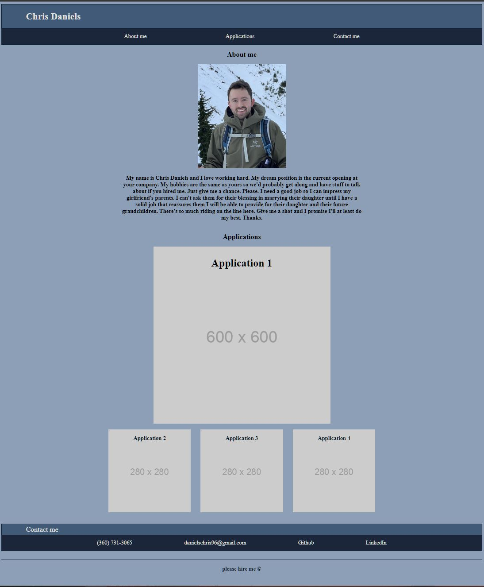

# Chris Daniels Portfolio Page

## Description

This project was intended to create a portfolio page for myself. Portfolio pages are important to have when looking for a career in web development. This page acts as a showcase of the applications that I will build over the following months. It is important to have an attractive and easily navigable page. Potential employers will visit this page to see what applications I have built. Those applications along with this page will help determine if they want to offer me an interview. 

My page was built using HTML and CSS. It is deployed on GitHub pages:
https://danielschris96.github.io/personal-portfolio-page/

## Usage

There are four applications shown on the page. Selecting an application links you to the application. There is a contact section that can be used to call, email, or visit my other public profiles.

## Credits

https://www.w3schools.com/css/css_pseudo_classes.asp
https://www.w3schools.com/css/css_navbar.asp
https://www.w3schools.com/howto/howto_css_image_text.asp

## License

None